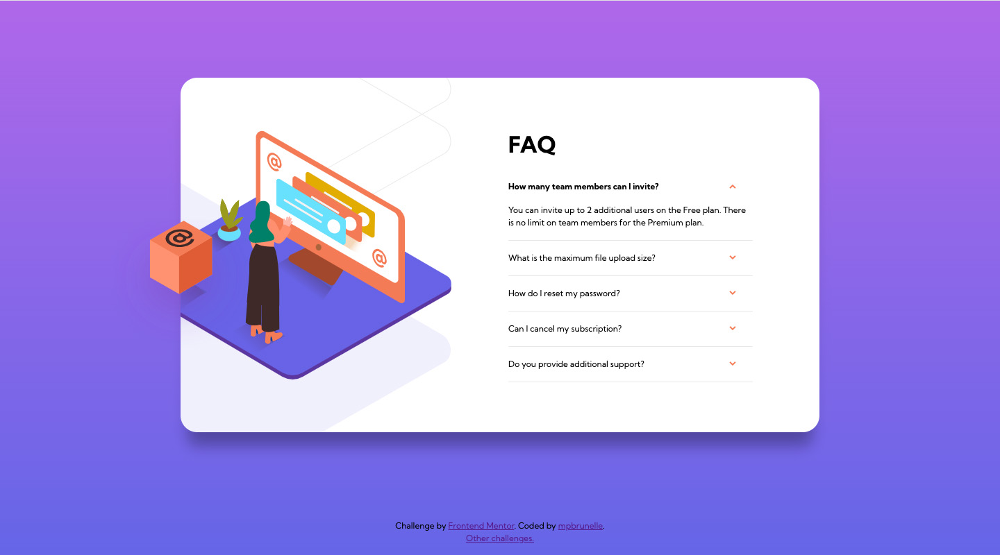

# Frontend Mentor - FAQ accordion card solution

This is a solution to the [FAQ accordion card challenge on Frontend Mentor](https://www.frontendmentor.io/challenges/faq-accordion-card-XlyjD0Oam). Frontend Mentor challenges help you improve your coding skills by building realistic projects.

## Table of contents

-   [Overview](#overview)
    -   [The challenge](#the-challenge)
    -   [Screenshot](#screenshot)
    -   [Links](#links)
-   [My process](#my-process)
    -   [Built with](#built-with)
    -   [What I learned](#what-i-learned)
    -   [Continued development](#continued-development)
    -   [Useful resources](#useful-resources)
-   [Author](#author)

## Overview

### The challenge

Users should be able to:

-   View the optimal layout for the component depending on their device's screen size
-   See hover states for all interactive elements on the page
-   Hide/Show the answer to a question when the question is clicked

### Screenshot



### Links

-   Solution URL: [https://github.com/mpbrunelle/training/tree/main/faq-accordion-card](https://github.com/mpbrunelle/training/tree/main/faq-accordion-card)
-   Live Site URL: [https://mpbrunelle.github.io/training/faq-accordion-card](https://mpbrunelle.github.io/training/faq-accordion-card)

## My process

### Built with

-   Semantic HTML5 markup
-   CSS custom properties
-   Flexbox
-   CSS Grid
-   Mobile-first workflow

### What I learned

To remove the default arrow that appears next to the summary:

```css
summary {
    list-style: none;
}
summary::-webkit-details-marker {
    display: none;
}
```

To replace it with something else:

```css
details summary::before {
    content: "🡒";
    color: red;
    /* you can style it however you want, use background-image for example */
}

/* By using [open] we can define different styles when the disclosure widget is open */
details[open] summary::before {
    content: "🡑";
    color: red;
}
```

### Continued development

Learn to animate the opening and closing of accordion (it doesn't work with CSS only, js needed).
See: [How to Animate the Details Element Using WAAPI](https://css-tricks.com/how-to-animate-the-details-element-using-waapi/)

### Useful resources

-   [Two Issues Styling the Details Element and How to Solve Them](https://css-tricks.com/two-issues-styling-the-details-element-and-how-to-solve-them/)
-   [Styling the details element](https://justmarkup.com/articles/2020-09-22-styling-and-animation-details/)
-   [SVG Viewport and viewBox](https://webdesign.tutsplus.com/tutorials/svg-viewport-and-viewbox-for-beginners--cms-30844): to position the image in the center of the SVG viewport (illustration-woman-online-mobile.svg)

## Author

-   Website - [Studio Quipo](https://studioquipo.com/en/)
-   Frontend Mentor - [@mpbrunelle](https://www.frontendmentor.io/profile/mpbrunelle)
