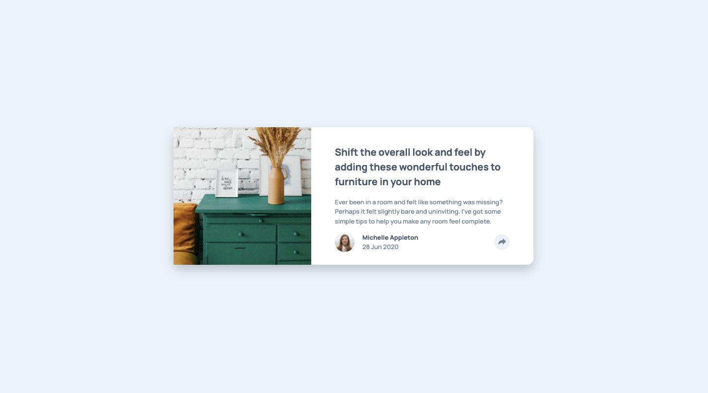

# Frontend Mentor - Article preview component solution

This is a solution to the [Article preview component challenge on Frontend Mentor](https://www.frontendmentor.io/challenges/article-preview-component-dYBN_pYFT). Frontend Mentor challenges help you improve your coding skills by building realistic projects.

## Table of contents

-   [Overview](#overview)
    -   [The challenge](#the-challenge)
    -   [Screenshot](#screenshot)
    -   [Links](#links)
-   [My process](#my-process)
    -   [Built with](#built-with)
    -   [What I learned](#what-i-learned)
    -   [Continued development](#continued-development)
    -   [Useful resources](#useful-resources)
-   [Author](#author)

## Overview

### The challenge

Users should be able to:

-   View the optimal layout for the component depending on their device's screen size
-   See the social media share links when they click the share icon

### Screenshot



### Links

-   Solution URL: [https://github.com/mpbrunelle/training/tree/main/fem--article-preview](https://github.com/mpbrunelle/training/tree/main/fem--article-preview)
-   Live Site URL: [https://mpbrunelle.github.io/training/fem--article-preview](https://mpbrunelle.github.io/training/fem--article-preview)

## My process

### Built with

-   Semantic HTML5 markup
-   CSS custom properties
-   Flexbox
-   Mobile-first workflow
-   Accessibility

### What I learned

Intesting property to add one shadow on multiple elements:

```css
filter: drop-shadow(10px 10px 20px rgba(0, 0, 0, 0.3));
```

### Useful resources

-   [Multiple elements with one shadow with CSS](https://www.youtube.com/watch?v=JvuIuWbxNvU)

## Author

-   Website - [Studio Quipo](https://studioquipo.com/en/)
-   Frontend Mentor - [@mpbrunelle](https://www.frontendmentor.io/profile/mpbrunelle)

## Acknowledgments

This is where you can give a hat tip to anyone who helped you out on this project. Perhaps you worked in a team or got some inspiration from someone else's solution. This is the perfect place to give them some credit.

**Note: Delete this note and edit this section's content as necessary. If you completed this challenge by yourself, feel free to delete this section entirely.**
