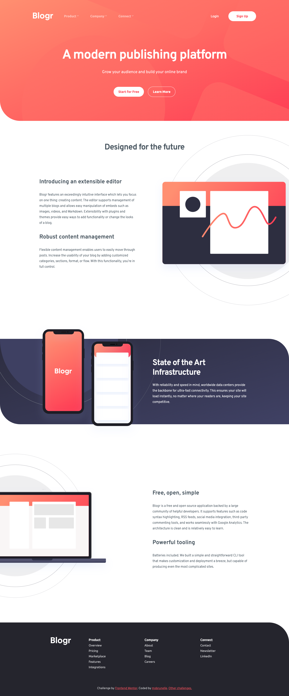

# Frontend Mentor - Blogr landing page solution

This is a solution to the [Blogr landing page challenge on Frontend Mentor](https://www.frontendmentor.io/challenges/blogr-landing-page-EX2RLAApP). Frontend Mentor challenges help you improve your coding skills by building realistic projects.

## Table of contents

-   [Overview](#overview)
    -   [The challenge](#the-challenge)
    -   [Screenshot](#screenshot)
    -   [Links](#links)
-   [My process](#my-process)
    -   [Built with](#built-with)
    -   [What I learned](#what-i-learned)
    -   [Useful resources](#useful-resources)
-   [Author](#author)
-   [Acknowledgments](#acknowledgments)

## Overview

### The challenge

Users should be able to:

-   View the optimal layout for the site depending on their device's screen size
-   See hover states for all interactive elements on the page

### Screenshot

### Links

-   [Solution](https://github.com/mpbrunelle/training/tree/main/fem--blogr-landing-page)
-   [Live site](https://mpbrunelle.github.io/training/fem--blogr-landing-page/)

## My process

### Built with

-   Semantic HTML5 markup
-   CSS custom properties
-   Flexbox
-   CSS Grid
-   Mobile-first workflow
-   Accessibility

### What I learned

-   I have used much more utility classes than I usually do.

### Useful resources

-   [Accessible components: menus & menu buttons](https://inclusive-components.design/menus-menu-buttons/#navigationmenubuttons)
-   [In praise of the unambiguous click menu](https://css-tricks.com/in-praise-of-the-unambiguous-click-menu/)
-   [Clicky Menus: Accessible and Progressively Enhanced Menu with Clicky Dropdowns](https://codepen.io/mrwweb/pen/pXqKZO)

## Author

-   Website - [mpbrunelle](https://studioquipo.com/en/)
-   Frontend Mentor - [@mpbrunelle](https://www.frontendmentor.io/profile/mpbrunelle)
