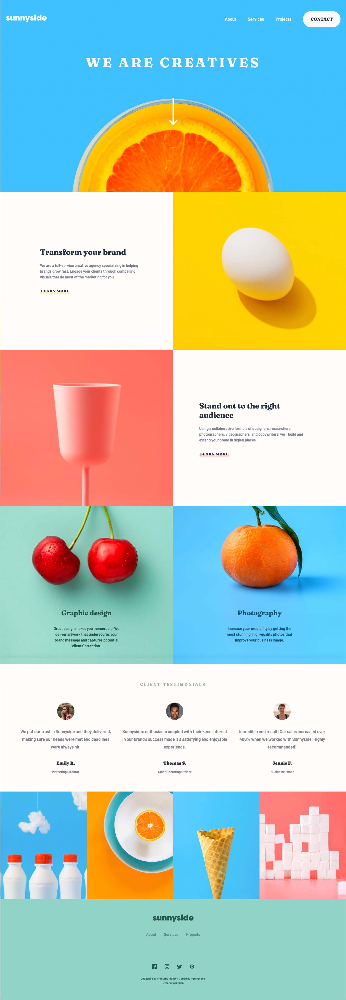

# Frontend Mentor - Sunnyside agency landing page solution

This is a solution to the [Sunnyside agency landing page challenge on Frontend Mentor](https://www.frontendmentor.io/challenges/sunnyside-agency-landing-page-7yVs3B6ef). Frontend Mentor challenges help you improve your coding skills by building realistic projects.

## Table of contents

-   [Overview](#overview)
    -   [The challenge](#the-challenge)
    -   [Screenshot](#screenshot)
    -   [Links](#links)
-   [My process](#my-process)
    -   [Built with](#built-with)
    -   [What I learned](#what-i-learned)
    -   [Continued development](#continued-development)
    -   [Useful resources](#useful-resources)
-   [Author](#author)
-   [Acknowledgments](#acknowledgments)

**Note: Delete this note and update the table of contents based on what sections you keep.**

## Overview

### The challenge

Users should be able to:

-   View the optimal layout for the site depending on their device's screen size
-   See hover states for all interactive elements on the page

### Screenshot

### Links

-   [Solution](https://github.com/mpbrunelle/training/tree/main/fem--sunnyside-agency-landing-page)
-   [Live site](https://mpbrunelle.github.io/training/fem--sunnyside-agency-landing-page/)

### Built with

-   Semantic HTML5 markup
-   CSS custom properties
-   Flexbox
-   CSS Grid
-   Mobile-first workflow
-   Fluid typography
-   Self hosted fonts
-   Inline SVG icons

### Useful resources

-   [Andy Bell’s Modern reset](https://piccalil.li/blog/a-modern-css-reset/) - This article explains the reset.
-   [Google webfonts helper](https://google-webfonts-helper.herokuapp.com/fonts) - Bundles all the fonts necessary for a projects and provides the corresponding CSS code.
-   [Accessible SVG](https://css-tricks.com/accessible-svgs/)

## Author

-   Website - [Studio Quipo](https://www.studioquipo.com/en/)
-   Frontend Mentor - [@mpbrunelle](https://www.frontendmentor.io/profile/mpbrunelle)
