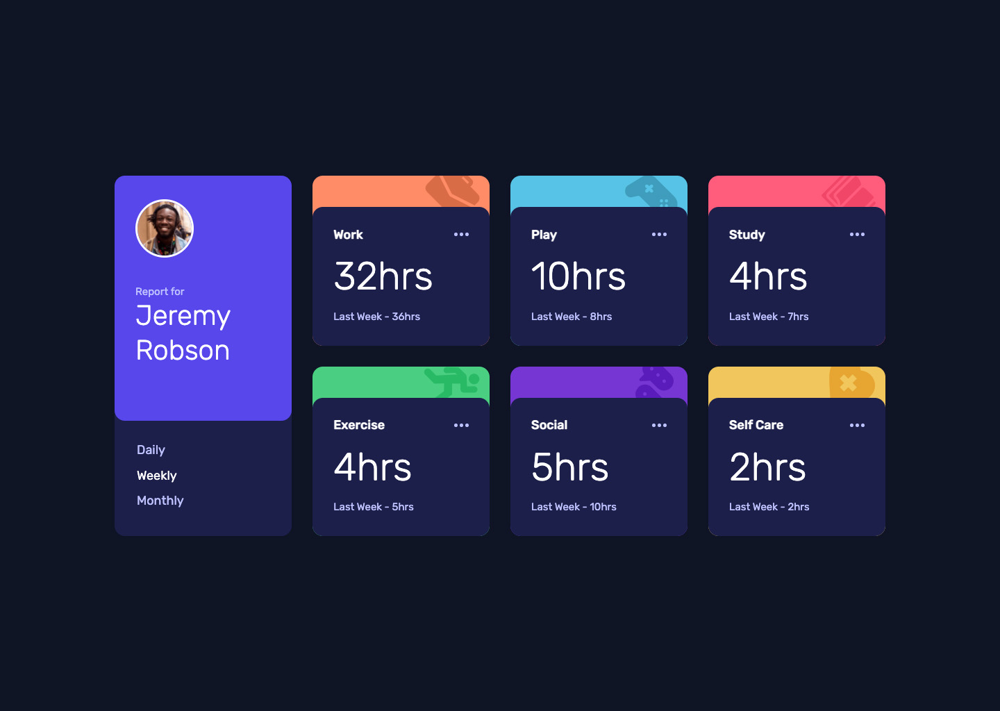

# Frontend Mentor - Time tracking dashboard solution

This is a solution to the [Time tracking dashboard challenge on Frontend Mentor](https://www.frontendmentor.io/challenges/time-tracking-dashboard-UIQ7167Jw). Frontend Mentor challenges help you improve your coding skills by building realistic projects.

## Table of contents

-   [Overview](#overview)
    -   [The challenge](#the-challenge)
    -   [Screenshot](#screenshot)
    -   [Links](#links)
-   [My process](#my-process)
    -   [Built with](#built-with)
    -   [What I learned](#what-i-learned)
    -   [Useful resources](#useful-resources)
-   [Author](#author)

## Overview

### The challenge

Users should be able to:

-   View the optimal layout for the site depending on their device's screen size
-   See hover states for all interactive elements on the page
-   Switch between viewing Daily, Weekly, and Monthly stats

Expected behaviour:

-   The text for the previous period's time should change based on the active timeframe. For Daily, it should read "Yesterday" e.g "Yesterday - 2hrs". For Weekly, it should read "Last Week" e.g. "Last Week - 32hrs". For monthly, it should read "Last Month" e.g. "Last Month - 19hrs".

### Screenshot

### Links

-   Solution URL: [Add solution URL here](https://your-solution-url.com)
-   Live Site URL: [Add live site URL here](https://your-live-site-url.com)

## My process

### Built with

-   Semantic HTML5 markup
-   CSS custom properties
-   Flexbox
-   CSS Grid
-   Self hosted fonts
-   Mobile-first workflow
-   Vanilla javascript
-   AJAX
-   [gulp](https://gulpjs.com/) - Task manager
-   Accessibility

### Continued development

CSS:

-   Better management of margins and paddings in modules to avoid clashes in layout.

Javascript:

-   The value of this.
-   AJAX
-   OOP

Gulp:

-   File minification
-   Adding Babel
-   Working with modules
-   Bundling modules

### Useful resources

-   [An Absolute Beginner's Guide to Using npm](https://nodesource.com/blog/an-absolute-beginners-guide-to-using-npm/)
-   [Gulp documentation](https://gulpjs.com/docs/en/getting-started/quick-start/)

## Author

-   Website - [mpbrunelle](https://www.studioquipo.com/en)
-   Frontend Mentor - [@yourusername](https://www.frontendmentor.io/profile/mpbrunelle)
